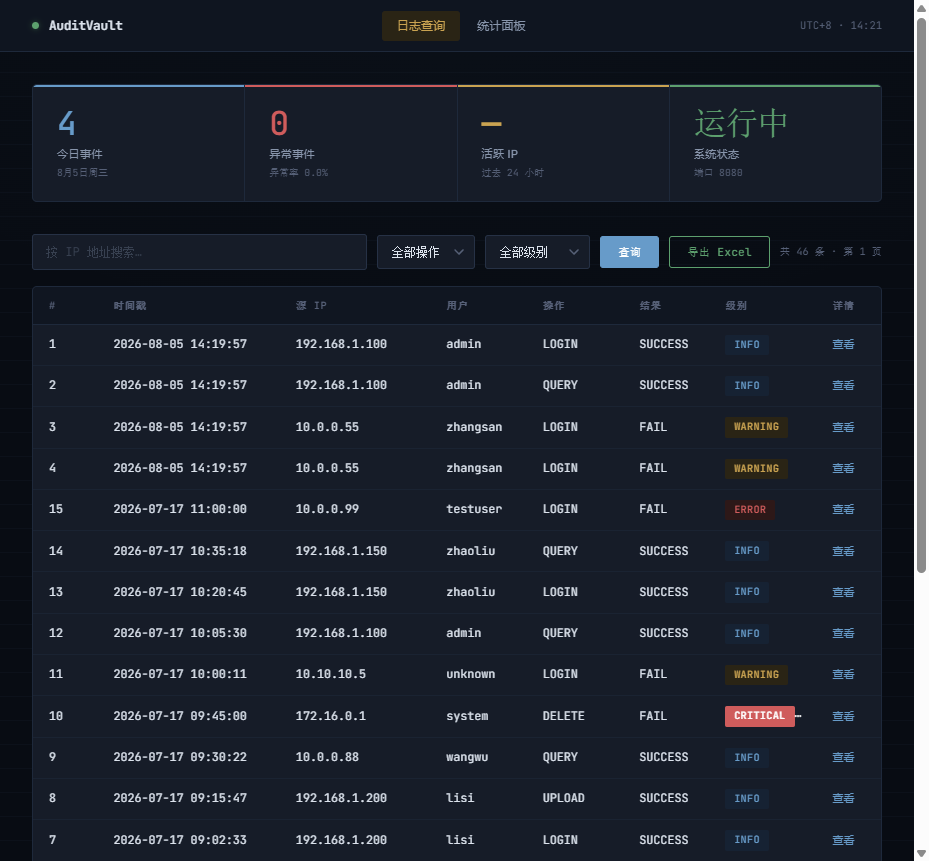
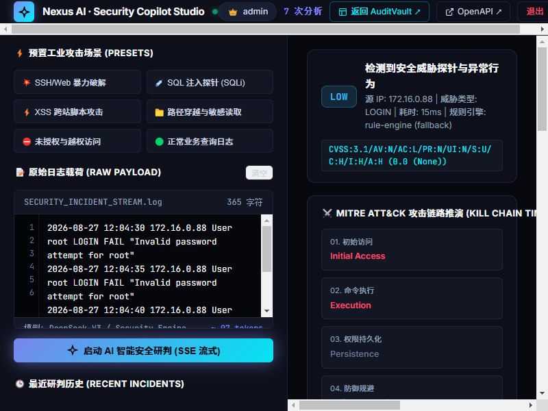

# Java 全栈开发 · 项目作品集

> 日志审计与分析领域 — 4 个项目，覆盖 Java / Python / AI / DevOps / CI/CD 全链路

[](https://github.com/Emiliamio/java-portfolio/actions/workflows/ci.yml)


---

## 项目总览

| # | 项目 | 技术栈 | 一句话 | 入口 |
|---|---|---|---|---|
| ① | **AuditVault** 日志审计 | Spring Boot + MySQL + Redis | Datadog/SigNoz SOC 遥测大屏、Live Tail 实时流、深度抽屉与 Webhook 采集 | `:8080` |
| ② | **LogScope** 日志解析器 | Python + Pandas + CLI | CSV/文本日志解析，异常检测，HTML/Excel 可视化报告 | CLI |
| ③ | **Nexus AI** 智能分析 | Spring Boot + Anthropic / DeepSeek | Security Copilot 研判工作台、CVSS 3.1 评分、MITRE 战术映射与自动 WAF 规则 | `:8081` |
| ④ | **技术博客** | Hexo + GitHub Pages | 项目复盘与技术文章 | [emiliamio.github.io](https://emiliamio.github.io) |

---

## 快速开始

唯一依赖：**Docker Desktop**。

```bash
cp .env.example .env            # 首次（可用默认值，AI 分析可选）
docker compose up -d             # MySQL + Redis + AuditVault + Nexus AI
```

| 服务 | URL | 说明 |
|---|---|---|
| AuditVault — 日志检索 | http://localhost:8080 | 含 Webhook 实时采集模拟器与导出 |
| AuditVault — 数据面板 | http://localhost:8080/dashboard.html | 今日事件、异常率与独立 IP 统计 |
| AuditVault — API 文档 | http://localhost:8080/swagger-ui.html | SpringDoc OpenAPI 3.0 交互接口中心 |
| Nexus AI — 智能分析 | http://localhost:8081 | SSE 流式分析、Markdown 导出与跨服务上报 |
| Nexus AI — API 文档 | http://localhost:8081/swagger-ui.html | SpringDoc OpenAPI 3.0 交互接口中心 |
| 技术博客 | https://emiliamio.github.io | 项目复盘与架构技术文章 |

**演示账号**（AuditVault 与 Nexus AI 共用）：

| 账号 | 密码 | 权限 |
|---|---|---|
| `admin` | `admin123` | 管理员：查询 + 导入 + 导出 |
| `user` | `user123` | 普通用户：仅查询 |

日志解析器按需运行（一键导出 HTML 可视化报告、Excel 与 SQL）：

```bash
docker compose --profile tools run --rm log-parser \
  -i sample_logs/access.csv -o /app/output --html --excel --sql
```

---

## 架构

```
┌──────────────────────────────────────────┐
│              浏览器 / 终端                 │
└────┬─────────┬──────────┬────────────────┘
     │         │          │
     ▼         ▼          ▼
┌─────────┐ ┌───────┐ ┌──────────┐
│AuditVault│ │Nexus AI│ │ 技术博客  │
│ :8080    │ │ :8081 │ │ GitHub   │
└────┬─────┘ └──┬────┘ │ Pages    │
     │          │      └──────────┘
     │   POST /api/logs/webhook (Logback 实时采集)
     │◀─────────┤
     ▼          ▼
┌─────────┐ ┌──────────────────┐
│  Redis  │ │     MySQL 8      │
│  :6379  │ │  log_entry       │
└─────────┘ │  audit_log       │
            │  ai_analysis     │
            └────────▲─────────┘
                     │
        ┌────────────┘
        │ LogScope CLI (Python)
        │ 离线解析 → SQL 批量导入
        └────────────
```

---

## 项目结构

```
├── .github/workflows/      # 统一 CI/CD 流水线 (Matrix 多语言测试)
├── 01-log-audit-system/    # Spring Boot · 日志审计查询 + Webhook 采集
├── 02-log-parser/          # Python CLI · 日志解析与异常检测
├── 03-log-ai-assistant/    # Spring Boot + LLM · AI 智能分析 (SSE 流式)
├── 02-tech-blog/           # Hexo · 技术博客
├── docker-compose.yml      # 一键编排全部服务
├── demo.sh                 # 本地演示脚本
├── docs/
│   ├── DEPLOY.md           # 云服务器部署指南
│   └── LOGBACK_INTEGRATION.md # Logback Webhook 采集接入指南
└── .env.example
```

---

## 技术栈

```
Java 17 · Spring Boot 3.2 · MyBatis · MySQL 8 · Redis 7
Spring Security · JWT · BCrypt · httpOnly Cookie · Logback Webhook
Python 3.12 · Pandas · Regex · argparse
Anthropic Messages API / DeepSeek · LLM Prompt Engineering · JSON 容错解析 · SSE Stream
Docker · Docker Compose · 多阶段构建 · HEALTHCHECK
Hexo · GitHub Pages · GitHub Actions CI/CD Pipeline
```


---

---

## 🖥️ 系统界面预览

| AuditVault 审计中心 (`:8080`) | Nexus AI 智能排障 (`:8081`) |
|:---:|:---:|
|  |  |
| *操作审计自闭环 · Webhook 实时采集 · 流式 Excel 导出* | *SSE 流式打字机推理 · 跨服务反向上报 · 智能处置建议* |

---

## 📚 详细技术文档

- 🚀 [大厂高频面试深度架构演进与答辩宝典](docs/INTERVIEW_DEEP_DIVE.md) —— *SXSSFWorkbook 内存防爆、HyperLogLog 伯努利试验原理、JWT 登出黑名单、亿级流量 Kafka+ClickHouse 演进*
- 📡 [Logback 实时采集 Webhook 接入指南](docs/LOGBACK_INTEGRATION.md) —— *客户端微服务 3 分钟极速接入模版*
- 🚢 [云服务器生产部署指南](docs/DEPLOY.md) —— *Docker Compose 一键启动与生产安全建议*

---

## License

MIT

